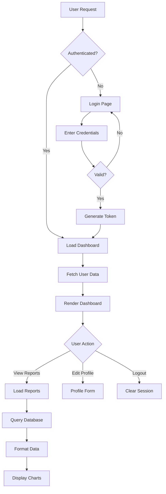
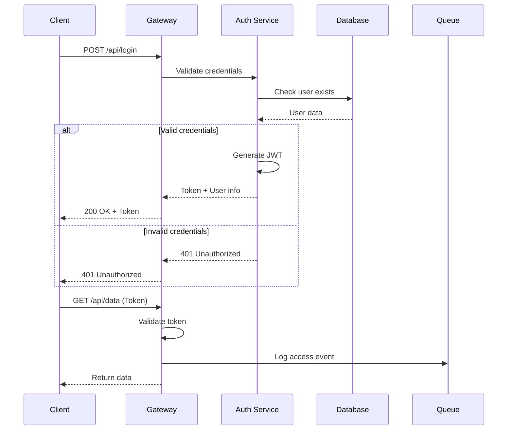
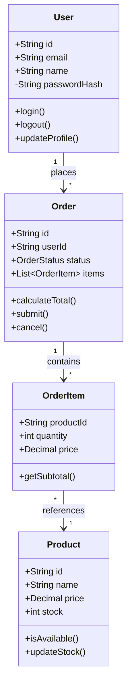

# /diagram

Generate architecture, flow, and relationship diagrams from code structure and documentation using ASCII art and mermaid syntax.

## Usage

```
/diagram [type: architecture|flow|sequence|class|entity] [scope]
```

## Diagram Generation Process

### 1. Code Analysis

```bash
# Analyze project structure
fd "main|index|app" --type f
rg "class|interface|struct|type" --type-add 'code:*.{rs,go,ts,java}'

# Find relationships
rg "import|require|use|extends|implements" -A 1 -B 1
rg "new|create|getInstance" -A 2

# Identify APIs and endpoints
rg "@(Get|Post|Put|Delete)|router\.|app\." -A 2
```

### 2. Diagram Types

#### Architecture Diagram (ASCII)

```
┌─────────────────────────────────────────────────────────────┐
│                      Frontend (React/Fresh)                  │
│  ┌─────────────┐  ┌──────────────┐  ┌─────────────────┐   │
│  │   Browser   │  │   Mobile App │  │   CLI Client    │   │
│  └──────┬──────┘  └──────┬───────┘  └────────┬────────┘   │
└─────────┼─────────────────┼──────────────────┼─────────────┘
          │                 │                  │
          └─────────────────┴──────────────────┘
                            │
                  ┌─────────▼─────────┐
                  │   Load Balancer   │
                  │    (HAProxy)      │
                  └─────────┬─────────┘
                            │
        ┌───────────────────┴───────────────────┐
        │                                       │
┌───────▼────────┐                    ┌────────▼────────┐
│   API Gateway  │                    │  Static Assets  │
│  (Kong/Envoy)  │                    │     (CDN)       │
└───────┬────────┘                    └─────────────────┘
        │
┌───────┴────────────────────────────────────┐
│              Microservices                  │
│  ┌──────────┐  ┌──────────┐  ┌──────────┐ │
│  │   Auth   │  │  Orders  │  │ Payments │ │
│  │ Service  │  │ Service  │  │ Service  │ │
│  └────┬─────┘  └────┬─────┘  └────┬─────┘ │
└───────┼─────────────┼─────────────┼───────┘
        │             │             │
        └─────────────┴─────────────┘
                      │
         ┌────────────┴────────────┐
         │                         │
┌────────▼────────┐      ┌─────────▼────────┐
│    PostgreSQL   │      │   Message Queue  │
│   (Primary DB)  │      │    (RabbitMQ)    │
└─────────────────┘      └──────────────────┘
```

#### Flow Diagram (Mermaid)



#### Sequence Diagram



#### Class Diagram



#### Entity Relationship Diagram

```
┌─────────────────┐         ┌─────────────────┐
│     users       │         │    orders       │
├─────────────────┤         ├─────────────────┤
│ id          PK  │────┐    │ id          PK  │
│ email       UQ  │    │    │ user_id     FK  │
│ name            │    └───>│ status          │
│ created_at      │         │ total           │
│ updated_at      │         │ created_at      │
└─────────────────┘         └────────┬────────┘
                                     │
                            ┌────────▼────────┐
                            │   order_items   │
                            ├─────────────────┤
                            │ id          PK  │
                            │ order_id    FK  │
                            │ product_id  FK  │
                            │ quantity        │
                            │ price           │
                            └────────┬────────┘
                                     │
                            ┌────────▼────────┐
                            │    products     │
                            ├─────────────────┤
                            │ id          PK  │
                            │ name            │
                            │ price           │
                            │ stock           │
                            │ category_id FK  │
                            └─────────────────┘
```

### 3. Component Diagram

```
┌───────────────────────────────────────────────────┐
│                  Frontend Layer                    │
│  ┌─────────────┐ ┌──────────────┐ ┌────────────┐ │
│  │   Header    │ │   Dashboard  │ │   Footer   │ │
│  │ Component   │ │  Component   │ │ Component  │ │
│  └──────┬──────┘ └──────┬───────┘ └─────┬──────┘ │
│         └────────────────┴───────────────┘        │
│                          │                         │
│                   ┌──────▼──────┐                 │
│                   │  App State  │                 │
│                   │  (Redux)    │                 │
│                   └──────┬──────┘                 │
└──────────────────────────┼────────────────────────┘
                           │
                    ┌──────▼──────┐
                    │  API Client │
                    │   (Axios)   │
                    └──────┬──────┘
                           │
┌──────────────────────────┼────────────────────────┐
│                   Backend Layer                    │
│                   ┌──────▼──────┐                 │
│                   │  REST API   │                 │
│                   │  Controller │                 │
│                   └──────┬──────┘                 │
│         ┌────────────────┼────────────────┐       │
│         │                │                │       │
│  ┌──────▼──────┐ ┌──────▼──────┐ ┌──────▼──────┐│
│  │   Service   │ │   Service   │ │   Service   ││
│  │    Layer    │ │    Layer    │ │    Layer    ││
│  └──────┬──────┘ └──────┬──────┘ └──────┬──────┘│
│         └────────────────┼────────────────┘       │
│                   ┌──────▼──────┐                 │
│                   │ Data Access │                 │
│                   │    Layer    │                 │
│                   └──────┬──────┘                 │
└──────────────────────────┼────────────────────────┘
                           │
                    ┌──────▼──────┐
                    │  Database   │
                    │ (PostgreSQL)│
                    └─────────────┘
```

### 4. Auto-Generation Script

```typescript
// generate-diagram.ts
import { walk } from "@std/fs/walk.ts";

async function generateArchitectureDiagram(rootPath: string) {
  const components: Map<string, string[]> = new Map();

  // Scan for components
  for await (const entry of walk(rootPath)) {
    if (entry.isFile && entry.name.endsWith(".ts")) {
      const content = await Deno.readTextFile(entry.path);

      // Extract imports
      const imports = content.match(/import.*from\s+['"](.+)['"]/g);
      if (imports) {
        components.set(entry.path, imports);
      }
    }
  }

  // Generate mermaid diagram
  let diagram = "graph TD\n";

  components.forEach((imports, file) => {
    const fileName = file.split("/").pop()?.replace(".ts", "");
    imports.forEach((imp) => {
      const dep = imp.match(/['"](.+)['"]/)?.[1];
      if (dep && !dep.startsWith("@") && !dep.startsWith(".")) {
        diagram += `  ${fileName} --> ${dep}\n`;
      }
    });
  });

  return diagram;
}
```

### 5. Interactive Diagrams

```html
<!-- For web output -->
<script src="https://cdn.jsdelivr.net/npm/mermaid/dist/mermaid.min.js"></script>
<script>
  mermaid.initialize({ startOnLoad: true });
</script>

<div class="mermaid">
  ${generatedDiagram}
</div>
```

## Output Format

```markdown
# ${DiagramType} Diagram

## Overview

[Brief description of what the diagram shows]

## Diagram

[ASCII or Mermaid diagram]

## Key Components

- **Component A**: Description
- **Component B**: Description
- **Component C**: Description

## Relationships

- A → B: Data flow for X
- B → C: Triggers Y process
- C → A: Returns Z result

## Notes

- [Important architectural decisions]
- [Scalability considerations]
- [Security boundaries]
```

## Diagram Best Practices

1. **Keep it simple** - Focus on key components
2. **Use consistent symbols** - Stick to standard notations
3. **Label clearly** - Add descriptive labels
4. **Show data flow** - Indicate direction with arrows
5. **Group related items** - Use boxes/boundaries
6. **Include legend** - Explain symbols if needed

## Guidelines

- Start with high-level overview
- Add detail progressively
- Use colors sparingly (ASCII compatible)
- Maintain aspect ratio for readability
- Export in multiple formats if needed
- Keep source files for updates
