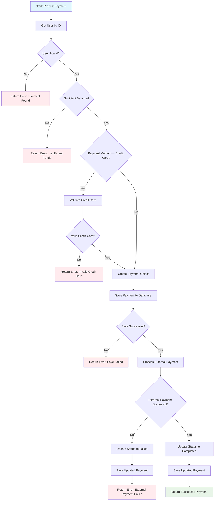
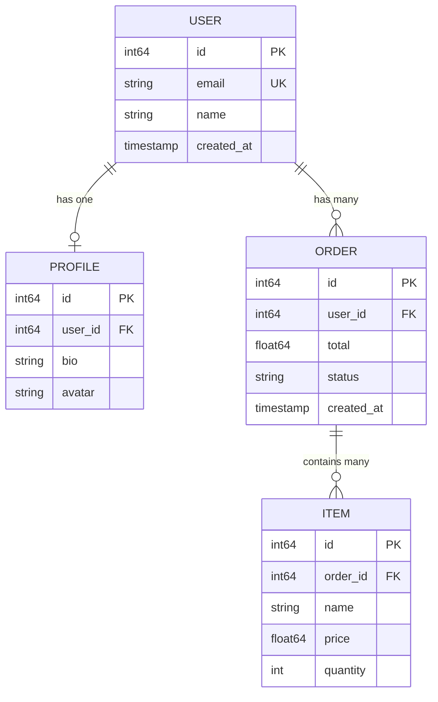
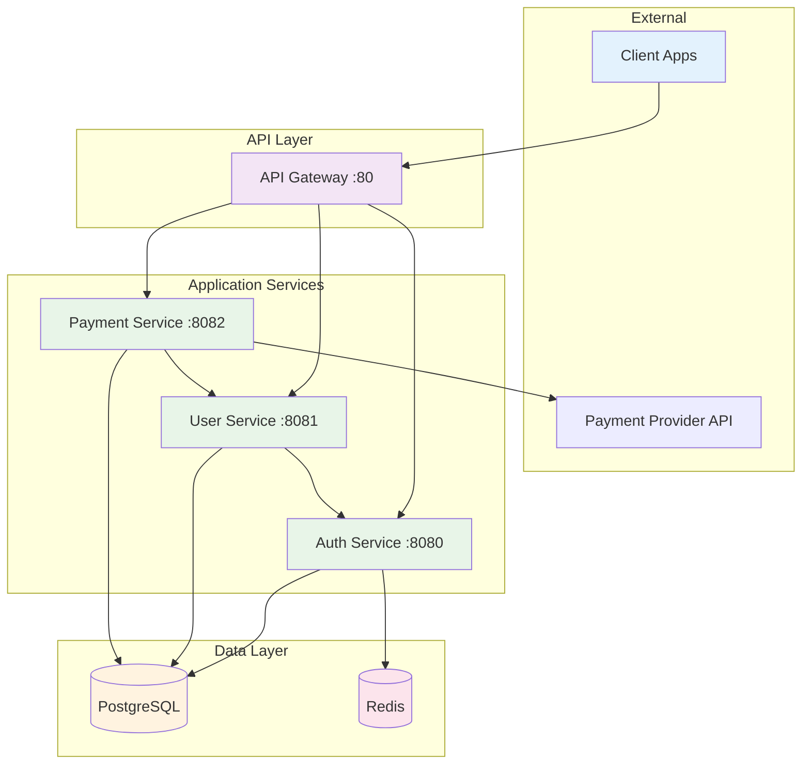
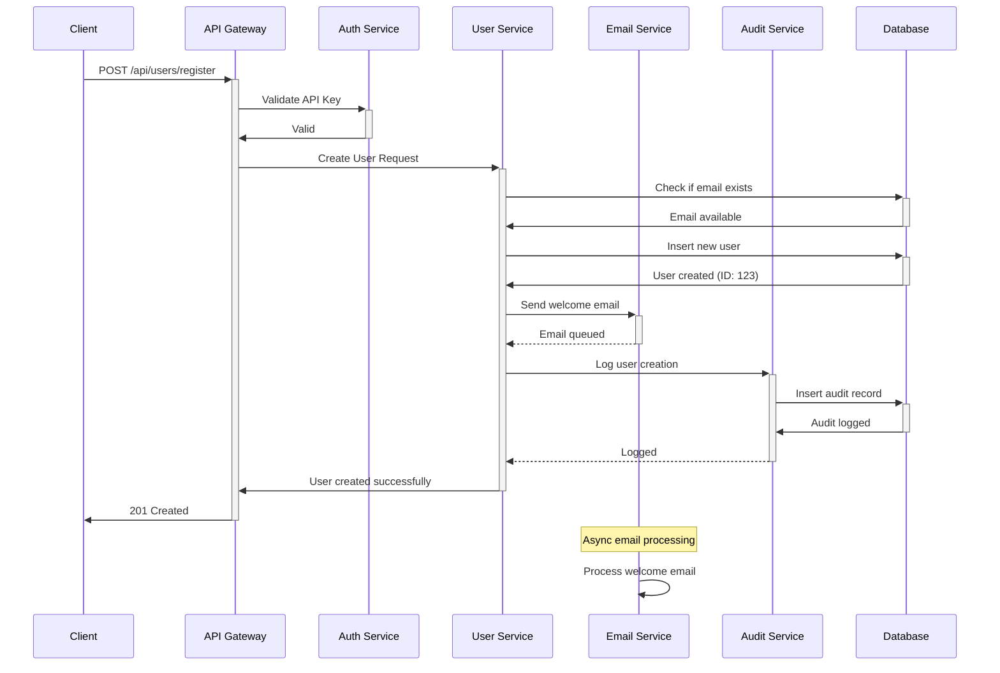
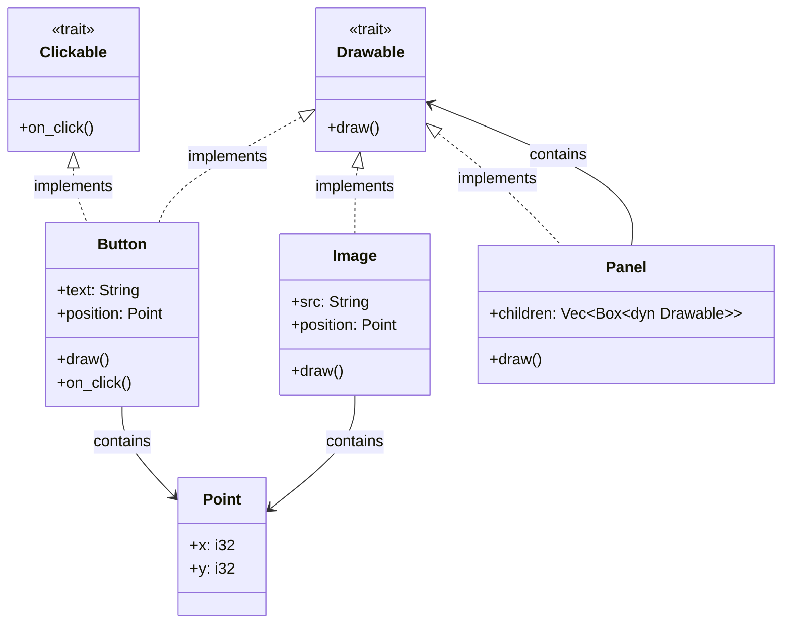
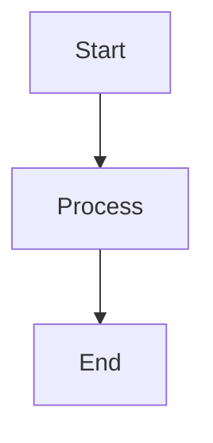
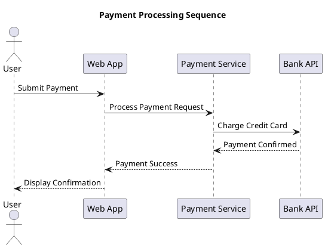
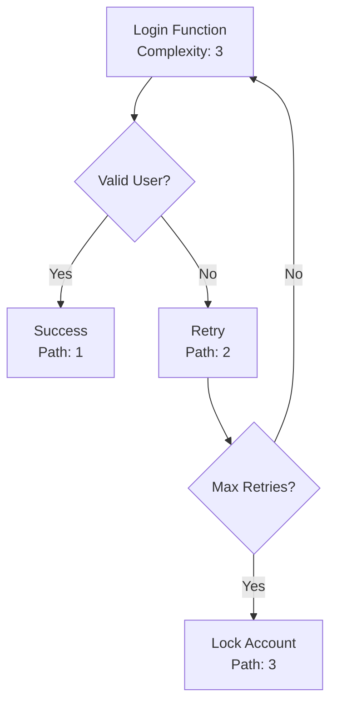
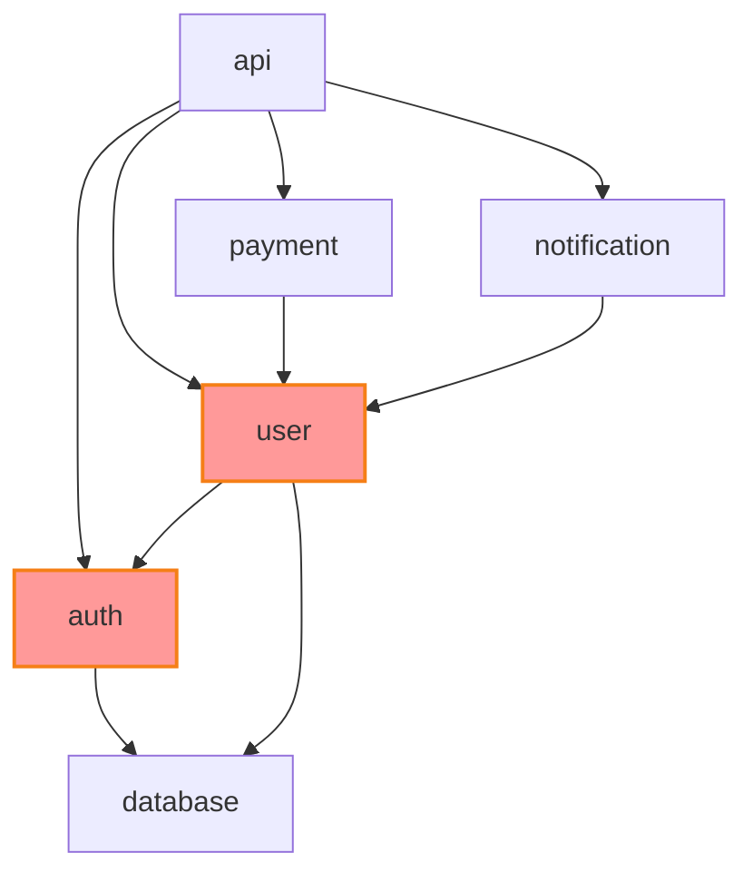

# /visualize

Analyzes code and architecture to generate explanatory diagrams.

## Usage

```
/visualize <target>
/visualize <target> --type <flowchart|sequence|erd|architecture>
/visualize <target> --format <mermaid|plantuml|graphviz>
/visualize <target> --output <file.md>
```

**Default Output Location**: `/docs/diagrams/` directory

## Description

This command transforms complex code, logic, and system architectures into clear, visual diagrams. A picture is worth a thousand lines of code - this command makes systems easier to understand, debug, and communicate about.

### What it generates:

#### 1. Code Flow Visualization

Analyzes function and method logic to create flowcharts:

**Function Analysis:**

```go
// Example Go function
func ProcessPayment(userID string, amount float64, paymentMethod string) (*Payment, error) {
    user, err := GetUser(userID)
    if err != nil {
        return nil, fmt.Errorf("user not found: %w", err)
    }
    
    if user.Balance < amount {
        return nil, errors.New("insufficient funds")
    }
    
    if paymentMethod == "credit_card" {
        if !ValidateCreditCard(user.CreditCard) {
            return nil, errors.New("invalid credit card")
        }
    }
    
    payment := &Payment{
        UserID: userID,
        Amount: amount,
        Method: paymentMethod,
        Status: "pending",
    }
    
    if err := SavePayment(payment); err != nil {
        return nil, fmt.Errorf("failed to save payment: %w", err)
    }
    
    if err := ProcessExternalPayment(payment); err != nil {
        payment.Status = "failed"
        SavePayment(payment)
        return nil, fmt.Errorf("external payment failed: %w", err)
    }
    
    payment.Status = "completed"
    SavePayment(payment)
    
    return payment, nil
}
```

**Generated Flowchart:**



#### 2. Database Schema Visualization

Analyzes database schemas and models to create Entity Relationship Diagrams:

**Go Struct Analysis:**

```go
type User struct {
    ID        int64     `db:"id" json:"id"`
    Email     string    `db:"email" json:"email"`
    Name      string    `db:"name" json:"name"`
    CreatedAt time.Time `db:"created_at" json:"created_at"`
    Profile   *Profile  `db:"-" json:"profile,omitempty"`
    Orders    []Order   `db:"-" json:"orders,omitempty"`
}

type Profile struct {
    ID     int64  `db:"id" json:"id"`
    UserID int64  `db:"user_id" json:"user_id"`
    Bio    string `db:"bio" json:"bio"`
    Avatar string `db:"avatar" json:"avatar"`
}

type Order struct {
    ID       int64     `db:"id" json:"id"`
    UserID   int64     `db:"user_id" json:"user_id"`
    Total    float64   `db:"total" json:"total"`
    Status   string    `db:"status" json:"status"`
    Items    []Item    `db:"-" json:"items,omitempty"`
}

type Item struct {
    ID       int64   `db:"id" json:"id"`
    OrderID  int64   `db:"order_id" json:"order_id"`
    Name     string  `db:"name" json:"name"`
    Price    float64 `db:"price" json:"price"`
    Quantity int     `db:"quantity" json:"quantity"`
}
```

**Generated ERD:**



#### 3. System Architecture Diagrams

Analyzes microservices and system interactions:

**Service Discovery:**

```yaml
# docker-compose.yml analysis
services:
  auth-service:
    image: auth:latest
    ports: ["8080:8080"]
    depends_on: [postgres, redis]

  user-service:
    image: user:latest
    ports: ["8081:8081"]
    depends_on: [postgres, auth-service]

  payment-service:
    image: payment:latest
    ports: ["8082:8082"]
    depends_on: [postgres, user-service]

  api-gateway:
    image: nginx:latest
    ports: ["80:80"]
    depends_on: [auth-service, user-service, payment-service]
```

**Generated Architecture Diagram:**



#### 4. API Interaction Sequences

Analyzes API calls and interactions to create sequence diagrams:

**REST API Flow Analysis:**

```go
// Analyzed from HTTP handlers and client code
func HandleUserRegistration(w http.ResponseWriter, r *http.Request) {
    // 1. Validate input
    user := parseUserFromRequest(r)
    
    // 2. Check if user exists
    existingUser := userService.GetByEmail(user.Email)
    
    // 3. Create user
    newUser := userService.Create(user)
    
    // 4. Send welcome email
    emailService.SendWelcomeEmail(newUser.Email)
    
    // 5. Create audit log
    auditService.LogUserCreation(newUser.ID)
}
```

**Generated Sequence Diagram:**



#### 5. Class and Module Relationships

Analyzes object-oriented code to show inheritance and composition:

**Rust Trait Analysis:**

```rust
trait Drawable {
    fn draw(&self);
}

trait Clickable {
    fn on_click(&self);
}

struct Button {
    text: String,
    position: Point,
}

struct Image {
    src: String,
    position: Point,
}

struct Panel {
    children: Vec<Box<dyn Drawable>>,
}

impl Drawable for Button {
    fn draw(&self) { /* implementation */ }
}

impl Clickable for Button {
    fn on_click(&self) { /* implementation */ }
}

impl Drawable for Image {
    fn draw(&self) { /* implementation */ }
}

impl Drawable for Panel {
    fn draw(&self) {
        for child in &self.children {
            child.draw();
        }
    }
}
```

**Generated Class Diagram:**



### 6. Network and Infrastructure Diagrams

Analyzes Kubernetes manifests and infrastructure code:

**Kubernetes Deployment Analysis:**

```yaml
# k8s/deployment.yaml
apiVersion: apps/v1
kind: Deployment
metadata:
  name: web-app
spec:
  replicas: 3
  template:
    spec:
      containers:
        - name: web
          image: nginx:latest
          ports:
            - containerPort: 80
---
apiVersion: v1
kind: Service
metadata:
  name: web-service
spec:
  selector:
    app: web-app
  ports:
    - port: 80
      targetPort: 80
---
apiVersion: networking.k8s.io/v1
kind: Ingress
metadata:
  name: web-ingress
spec:
  rules:
    - host: app.example.com
      http:
        paths:
          - path: /
            backend:
              service:
                name: web-service
                port:
                  number: 80
```

**Generated Infrastructure Diagram:**

```mermaid
graph TB
    subgraph "Internet"
        Users[Users]
    end
    
    subgraph "Kubernetes Cluster"
        subgraph "Ingress"
            Ingress[Ingress Controller<br/>app.example.com]
        end
        
        subgraph "Services"
            Service[web-service<br/>ClusterIP:80]
        end
        
        subgraph "Pods"
            Pod1[web-app-pod-1<br/>nginx:latest]
            Pod2[web-app-pod-2<br/>nginx:latest]
            Pod3[web-app-pod-3<br/>nginx:latest]
        end
    end
    
    Users --> Ingress
    Ingress --> Service
    Service --> Pod1
    Service --> Pod2
    Service --> Pod3
    
    style Users fill:#e3f2fd
    style Ingress fill:#f3e5f5
    style Service fill:#e8f5e8
    style Pod1 fill:#fff3e0
    style Pod2 fill:#fff3e0
    style Pod3 fill:#fff3e0
```

## Output Formats

### Mermaid (Default)

Generates Mermaid.js diagrams that render in GitHub, GitLab, and VS Code:

````markdown
# Function Flow Analysis


````

````
### PlantUML
Generates PlantUML diagrams for complex enterprise architectures:


## Examples

### Visualize a function:

```
/visualize ./src/payment.go:ProcessPayment
```

### Create database ERD:

```
/visualize ./models --type erd
```

### Generate system architecture:

```
/visualize ./docker-compose.yml --type architecture
```

### Create API sequence diagram:

```
/visualize ./api/handlers --type sequence
```

### Output to specific file:

```
/visualize ./src/auth.rs --output docs/diagrams/auth-flow.md
```

### Default outputs (created automatically):

```
/visualize ./src/payment.go          # Creates docs/diagrams/payment-flow.md
/visualize ./models --type erd       # Creates docs/diagrams/database-schema.md
/visualize ./docker-compose.yml     # Creates docs/diagrams/system-architecture.md
```

## File Structure Created

```
project-root/
└── docs/
    └── diagrams/
        ├── payment-flow.md          # Function flowcharts
        ├── database-schema.md       # Entity relationship diagrams  
        ├── system-architecture.md   # System and service diagrams
        ├── api-sequences.md         # API interaction sequences
        ├── class-relationships.md   # Class and module diagrams
        └── infrastructure.md        # Kubernetes and infrastructure
```

## Advanced Features

### Interactive Diagrams

Generates interactive diagrams with clickable elements:


### Complexity Analysis

Annotates diagrams with complexity metrics:



### Dependency Analysis

Shows dependency relationships and potential circular dependencies:



## Integration with Other Commands

- Use with `/document` to include diagrams in generated documentation
- Combine with `/refactor` to visualize before/after architecture changes
- Use with `/review` to create visual explanations for code reviews
- Integrate with `/epic` to show system-wide architectural changes
